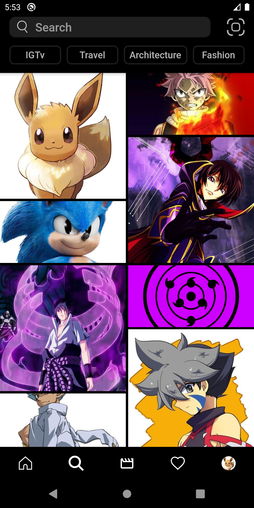

# Flutter programming
Learn to flutter is one of the greatest things I have ever done. Flutter is fairly easy and also it is very fun to use, figuring out the codes from online documents and stack overflow, watching the youtube video, building a new widget for later use, or even building a clone app is very fun and interesting.
 
### Languages & tools :
[][android]
[][dart]
[][flutter]
  

|Covid19 Home| Covid19 stats |Classroom Home|Classroom Stream|
|------|-------|-------|------|
|||||
|Classroom Classwork| Classroom Peoples |ChatApp Home|ChatApp Chats|
|||||
|TravelApp Home| TravelApp view |WhatsApp Chats|WhatsApp Status|
|||||
|WhatsApp Calls| WhatsApp view |PdfCoverter home|PdfConverter select|
|||||
|Instagram Home| Instagram Explore|Instagram Watch home|Instagram Profile|
|||||

### Connect with me :  

  
 

[website]: https://abhilashtuofficial.github.io/
[youtube]: https://www.youtube.com/channel/UC8iP2LKB-V1g2jMTbe6Pb4Q
[instagram]: https://www.instagram.com/abhilash_tu/
[linkdein]: https://www.linkedin.com/in/abhilash-tu-160630190/
[vscode]: https://code.visualstudio.com/
[github]: https://github.com/AbhilashTUofficial
[web]: https://github.com/AbhilashTUofficial/Web-development
[js]: https://github.com/AbhilashTUofficial/JavaScript-programming
[python]: https://github.com/AbhilashTUofficial/Python-programming
[dart]: https://github.com/AbhilashTUofficial/CloneApps
[c/c++]: https://github.com/AbhilashTUofficial/Cpp-programming
[flutter]: https://github.com/AbhilashTUofficial/CloneApps
[java]: https://github.com/AbhilashTUofficial/java-programming
[android]: https://github.com/AbhilashTUofficial/CloneApps
[behance]: https://www.behance.net/abhilashstorm
